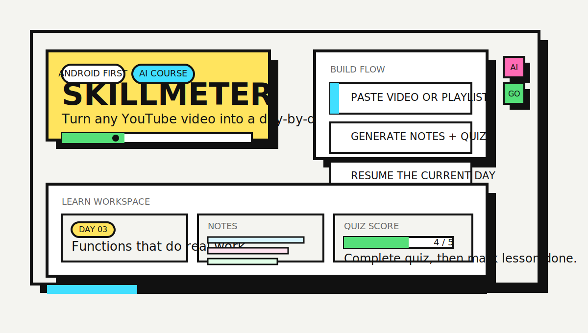

<p align="center">
  
</p>

<h1 align="center">Skillmeter</h1>

<p align="center">
  Android-first AI course builder for YouTube.<br />
  Turn long videos and playlists into paced learning routes with notes, quizzes, and progress tracking.
</p>

<p align="center">
  
  
  
  
  
</p>

## What Skillmeter Does

Skillmeter takes the raw abundance of YouTube learning content and turns it into something you can actually finish.

Instead of dropping people into a 3-hour tutorial or a loose playlist, the app builds a structured route:

- break content into sections
- group those sections into daily sessions
- generate notes and quizzes
- keep progress visible in one learn workspace

The current app experience is built around:

| Surface | What it handles |
| --- | --- |
| `Onboarding` | first-run intro, product framing, auth handoff |
| `Home` | One Shot vs Playlist flow, YouTube URL input, daily time, generation state |
| `Courses` | course library and reopen flow |
| `Learn` | player, daily plan, modules, notes, quiz, completion gating |
| `Profile` | stats, reminders, plan state, sign out |

## Product Loop

| 1. Paste | 2. Build | 3. Learn |
| --- | --- | --- |
| Add a YouTube video or playlist | Generate sections, notes, quizzes, and day-by-day pacing | Resume your current lesson, finish the quiz, and keep your streak moving |

## Theme

The repo uses the same neo-brutalist design language as the app:

- `paper` `#F4F4F0`
- `ink` `#111111`
- `yellow` `#FFE45E`
- `cyan` `#41DFFF`
- `pink` `#FF6BB5`
- `green` `#55E079`

Theme tokens live in [constants/skillmeterTheme.ts](./constants/skillmeterTheme.ts).

## Stack

| Layer | Tech |
| --- | --- |
| App | Expo + React Native + Expo Router |
| UI | StyleSheet-first neo-brutalist components with NativeWind installed |
| State | Zustand + AsyncStorage persistence |
| Backend | Supabase Auth, DB, Edge Functions |
| Video | `react-native-youtube-iframe` |
| Notifications | Expo Notifications |
| AI pipeline target | OpenAI through Supabase Edge Functions |

## Current Build Shape

This repo is set up so the frontend still runs even when Supabase is not configured.

- with Supabase env vars present, the app calls the backend contract in [supabase/functions/README.md](./supabase/functions/README.md)
- without env vars, `lib/api.ts` falls back to local demo data so every route stays testable

That makes UI iteration much easier while backend functions are still being deployed.

## Quick Start

```bash
npm install
cp .env.example .env
npx expo start --lan
```

Then open:

- Expo Go on Android
- an Android emulator
- or the web preview with `npx expo start --web`

## Environment

Create `.env` from [.env.example](./.env.example):

```bash
EXPO_PUBLIC_SUPABASE_URL=
EXPO_PUBLIC_SUPABASE_ANON_KEY=
```

If those values are empty, the app stays in demo-backed mode.

## Backend Contract

Important backend references:

- [supabase/schema.sql](./supabase/schema.sql) - database schema and RLS policies
- [supabase/functions/README.md](./supabase/functions/README.md) - Edge Function contract expected by the mobile app
- [lib/api.ts](./lib/api.ts) - frontend API facade with demo fallback
- [stores/useSkillmeterStore.ts](./stores/useSkillmeterStore.ts) - auth, courses, progress, quiz, notifications, and onboarding state

Expected backend responsibilities:

- keep OpenAI and YouTube secrets out of the app
- return nested course data shaped for the Learn workspace
- persist progress, quiz scores, daily session state, and profile settings

## Folder Map

```text
app/
  onboarding.tsx
  login.tsx
  signup.tsx
  (tabs)/
    home.tsx
    courses.tsx
    learn.tsx
    profile.tsx
components/
  AppScaffold.tsx
  CourseUI.tsx
  Neo.tsx
constants/
  skillmeterTheme.ts
data/
  demoCourse.ts
lib/
  api.ts
  courseSelectors.ts
  notifications.ts
  supabase.ts
stores/
  useSkillmeterStore.ts
supabase/
  schema.sql
  functions/README.md
```

## Main UX Notes

- onboarding is the first route
- auth gates the tab app
- tapping a course opens the Learn tab with that course loaded
- quiz completion unlocks section completion in Learn
- the bottom nav uses the same sharp neo-brutalist visual language as the rest of the app

## Status

The project is already in a strong frontend shape for Android-first iteration:

- onboarding, login, signup, Home, Courses, Learn, Profile, and paywall routes exist
- One Shot and Playlist flows are wired through shared app state
- course progress, quiz scores, and reminder settings are handled in the store
- TypeScript and Expo export checks are passing

## Notes For Contributors

- prefer the existing sharp-edge component language over introducing a softer style
- keep the palette anchored to `paper`, `ink`, `yellow`, `cyan`, `pink`, and `green`
- if you touch product wording, use `Skillmeter` as the primary brand name

---

<p align="center">
  Built for people who learn from YouTube and want an actual route, not just another tab left open.
</p>
